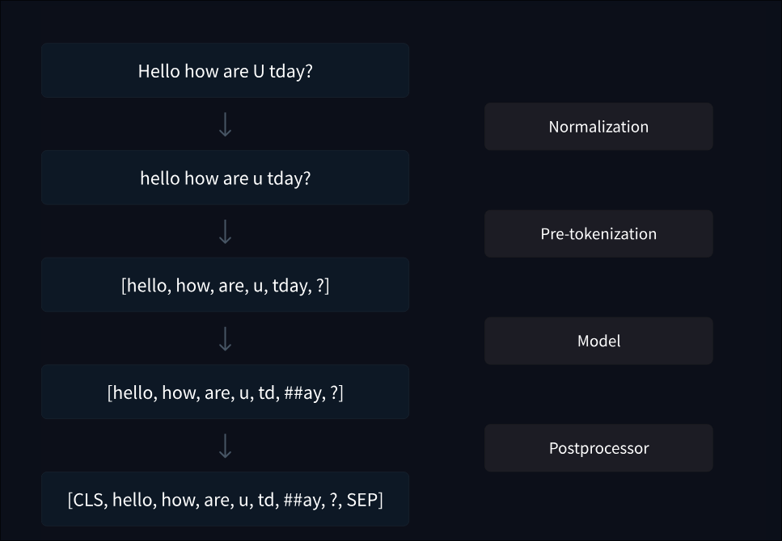

# Data preprocessing
- Common steps:
  - Cleaning: Remove duplicates, irrelevant content, and formatting issues.
  - Tokenization: Convert text into tokens using the model's tokenizer.
  - Normalization: Lowercasing, removing special characters, etc. -> Very dependent on use case, less so for modern LLMs.
  - Splitting: Divide data into training, validation, and test sets.

Note: The model in the image refers to tokenization model, not LLM. 
<!-- image source: https://huggingface.co/datasets/huggingface-course/documentation-images/resolve/main/en/chapter6/tokenization_pipeline-dark.svg -->